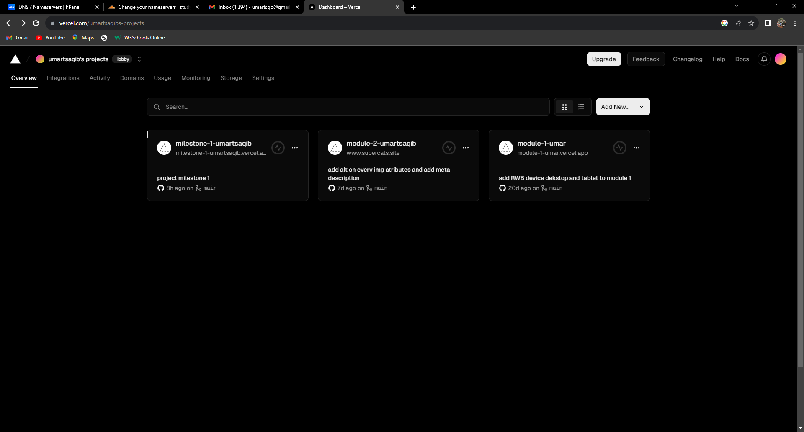
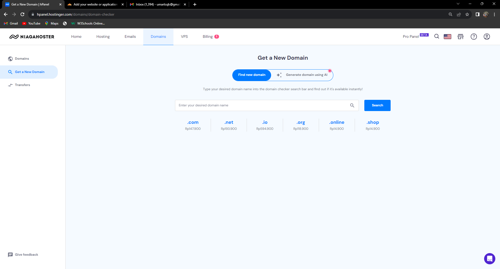
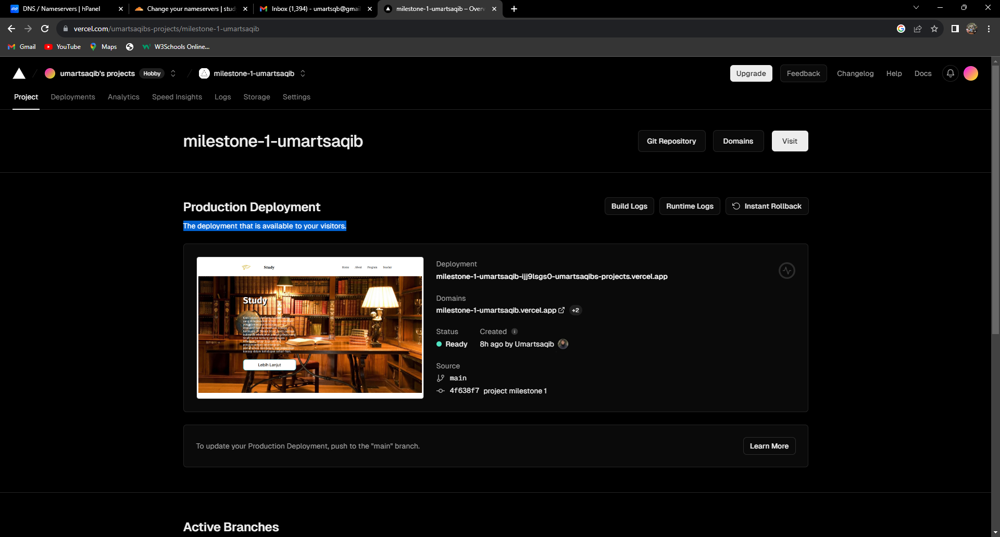
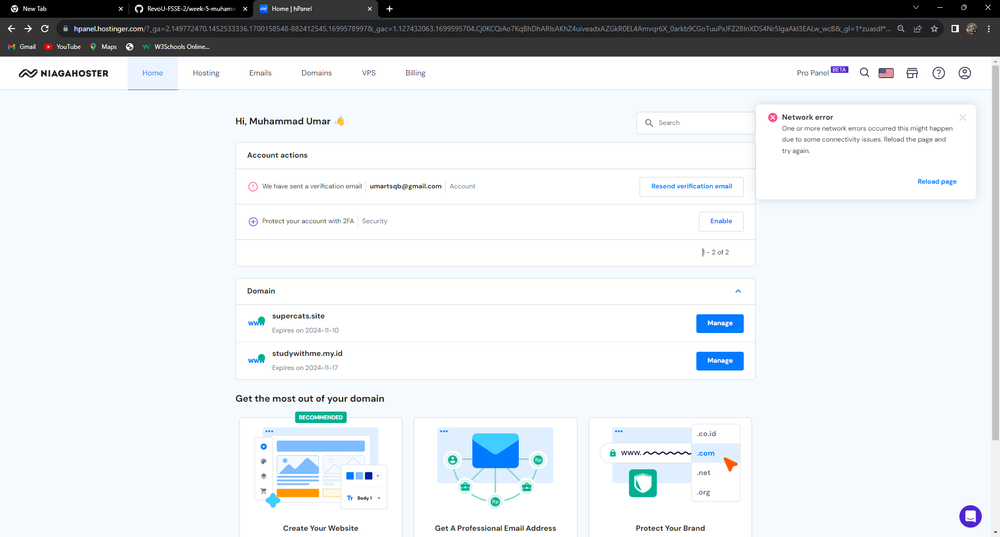
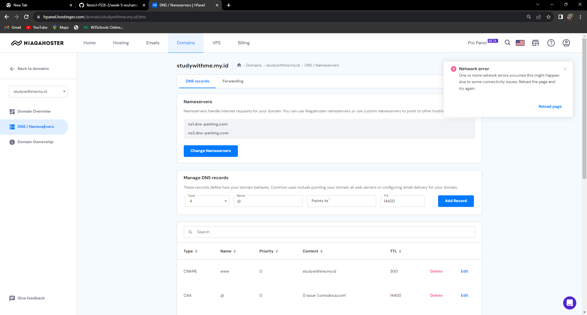
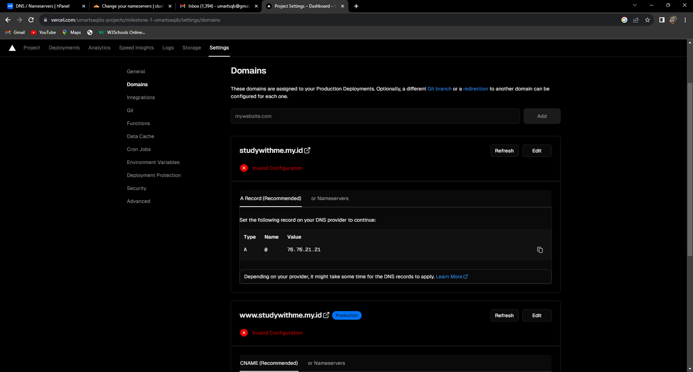

# Welcome to Study website

nama saya Muhammad Umar Tsaqib, di project kali ini saya membuat website company profile tentang study dimana didalamnya terdapat materi2 seputar teknologi

## STRUKTUR

- **Header**
  - Navbar
- **Main**
  - info section
- **Article**
  - about section
  - program section
  - teacher section
- **Footer**
  - copyright

## Apasaja yang saya gunakan untuk membuat website STUDY
- **HTML**
- **CSS**
- **JavaScript** 
- **External/Internal Source**
  - Icon
  - Image

## SET UP

yang pastinya kita harus memiliki akun di github terlebih dahulu,setelah mempunyai akun maka pastikan kita sudah tersambung dengan github

1.Clone Repository

> gh repo clone revou-fsse-3/milestone-1-Umartsaqib 

2. setelah sudah di clone maka kita tinggal melakukan perubahan didalamnya,setelah sudah melakukan perubahan, kita dapat melakukan push dengan cara

>git add .

>git commit -m'update massage'

>git push

## DEPLOYMENT
project ini di deploy melalui Vercel, mari simak apa saja yang perlu dilakukan dalam deployment ini

1.Connect akun ke vercel dengan menggunakan akun github yang kita miliki

setelah mengconnectkan akun maka akan muncul tampilan seperti dibawah ini

2.bikin akun di niagahoster dan sewa domain
setelah membuat akun di niagahoster maka pilih nama untuk website anda

3.pilih sewa domain yang murah

4.lakukan pembayaran

setelah tahapan2 tersebut dilakukan lanjut ke tahapan selanjutnya

5.membuka halaman vercel kembali,pilih project,dan tekan tombol domain

6.ubah record dns yang ada pada vercel ke niagahoster

dengan cara pergi kehalaman niagahoster dan pilih domain yang ingin di manage

setelah mengikuti tahapan2 berikut maka domain akan berjalan dengan baik

